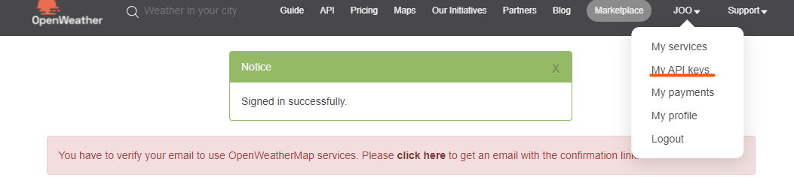

# Chrome-app

---

## 1. 개요

> Nomard corder 강의를 수강하면서 제작한 Chrome-app 클론 코딩입니다.
>
> 웹 페이지의 간단한 화면을 구현했습니다.

## 2. 사용 언어

> -  
> -  
> -  

## 3.  주요 기능

> - 시간 및 날씨 표시
> - 로그인 및 로그인 기록 저장
> - 화면 하단 명언

## 4. 주의 사항

> 코드에 있는  API key는 삭제되어 있습니다.
>
> [OpenWeather](https://openweathermap.org/api) 에 가입한 뒤 API key를 발급 받아야 합니다.

